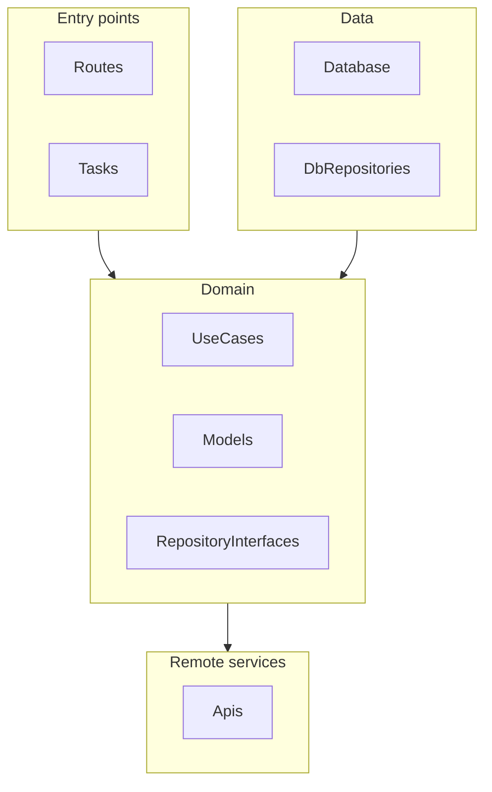
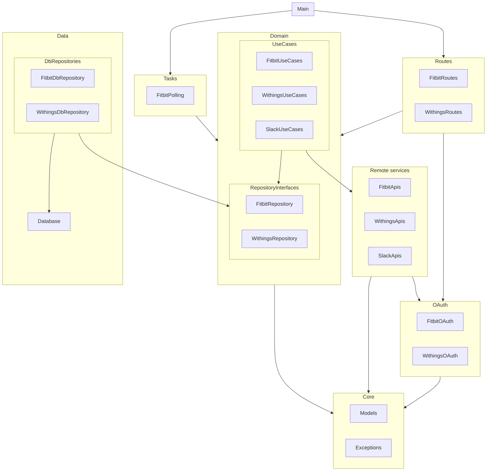

# Architecture

The arrows in the architecture indicate dependencies. For example, the Domain layer depends on the Data layer.

## Overview

```mermaid
graph TD

    subgraph EntryPoints[Entry points]
        Routes
        Tasks
    end
    subgraph Domain
        UseCases
        Models
        RepositoryInterfaces
    end
    subgraph Data
        Database
        DbRepositories
    end
    subgraph RemoteServices[Remote services]
        Apis
    end

    EntryPoints-->Domain
    Data-->Domain
    Domain-->RemoteServices
```

## More detailed view

```mermaid
graph TD
    subgraph Main
    end
    subgraph Routes
        FitbitRoutes
        WithingsRoutes
    end
    subgraph Tasks
        FitbitPolling
    end
    subgraph Domain
        subgraph UseCases
            FitbitUseCases
            WithingsUseCases
            SlackUseCases
        end
        subgraph RepositoryInterfaces
            FitbitRepository
            WithingsRepository
        end
    end
    subgraph Data
        Database
        subgraph DbRepositories
            FitbitDbRepository
            WithingsDbRepository
        end
    end
    subgraph RemoteServices[Remote services]
        FitbitApis
        WithingsApis
        SlackApis
    end
    subgraph Core
        CoreModels[Models]
        Exceptions
    end
    subgraph OAuth
        FitbitOAuth
        WithingsOAuth
    end


    Main-->Routes
    Main-->Tasks
    Tasks-->Domain
    Routes-->Domain
    DbRepositories-->Database
    DbRepositories-->RepositoryInterfaces
    UseCases-->RemoteServices
    UseCases-->RepositoryInterfaces
    Domain-->Core
    RemoteServices-->Core
    RemoteServices-->OAuth
    Routes-->OAuth
    OAuth-->Core
```
