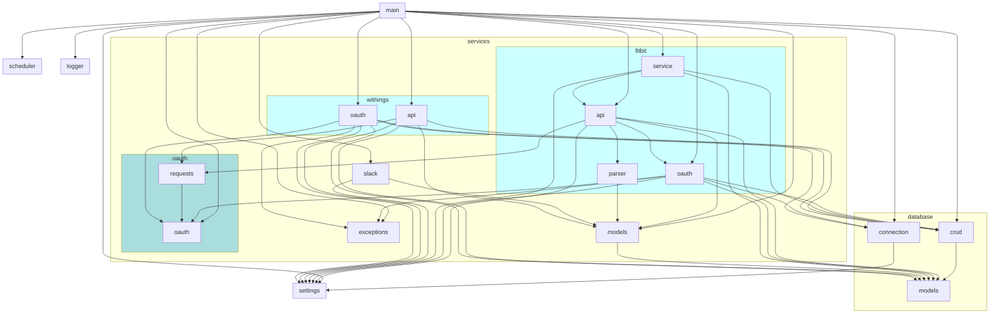

```mermaid
flowchart TB
    subgraph database
        connection
        crud
        models
    
    end
    subgraph services
        subgraph fitbit
            style fitbit fill:#CFF
            apifitbit[api]
            oauthfitbit[oauth]
            parser
            service
        end
        subgraph withings
            style withings fill:#CFF
            apiwithings[api]
            oauthwithings[oauth]
        end
        subgraph oauth
            style oauth fill:#ADD
            oauth2[oauth]
            requests
        end
        slack
        exceptions
        servicesmodels[models]
    end
    subgraph logger
    end
    subgraph scheduler
    end
    subgraph settings
    end
    subgraph main
    end

    connection --> settings
    crud --> models
    main --> logger
    main --> scheduler
    main --> crud
    main --> connection
    main --> servicesmodels
    main --> slack
    main --> exceptions
    main --> apifitbit
    main --> oauthfitbit
    main --> service
    main --> oauth2
    main --> apiwithings
    main --> oauthwithings
    main --> settings
    apifitbit --> models
    apifitbit --> servicesmodels
    apifitbit --> parser
    apifitbit --> oauthfitbit
    apifitbit --> requests
    apifitbit --> settings
    oauthfitbit --> crud
    oauthfitbit --> models
    oauthfitbit --> connection
    oauthfitbit --> exceptions
    oauthfitbit --> oauth2
    oauthfitbit --> settings
    parser --> servicesmodels
    service --> crud
    service --> models
    service --> apifitbit
    service --> settings
    servicesmodels --> models
    requests --> oauth2
    slack --> servicesmodels
    slack --> settings
    apiwithings --> crud
    apiwithings --> models
    apiwithings --> servicesmodels
    apiwithings --> requests
    apiwithings --> settings
    oauthwithings --> crud
    oauthwithings --> models
    oauthwithings --> connection
    oauthwithings --> exceptions
    oauthwithings --> oauth2
    oauthwithings --> settings
```  

