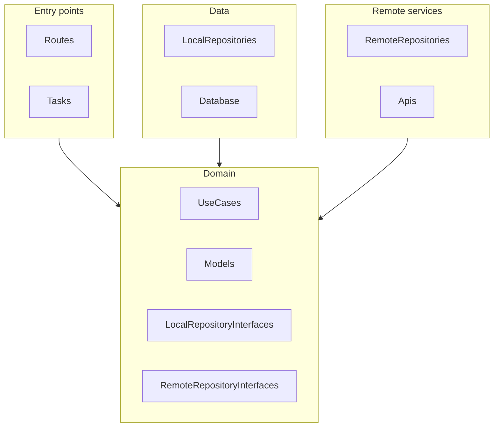
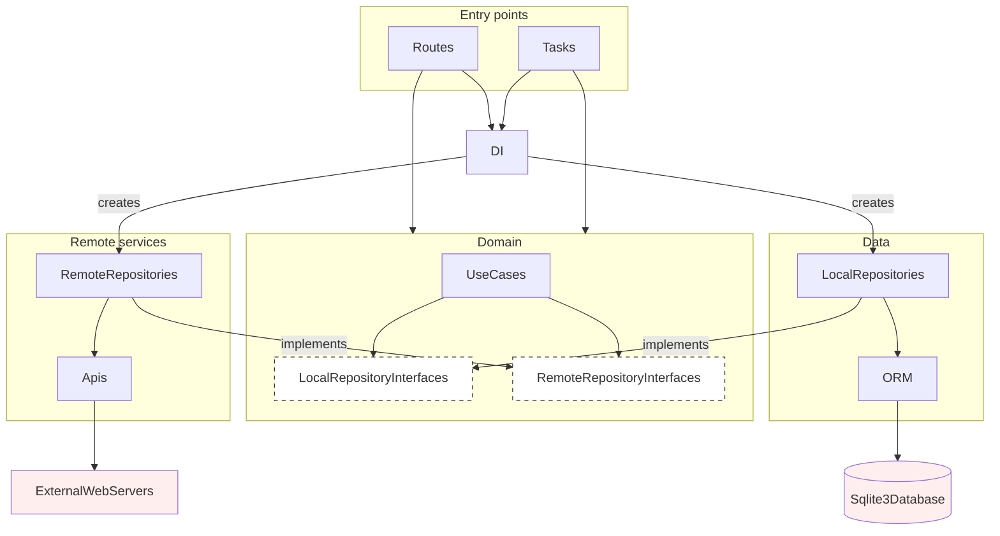
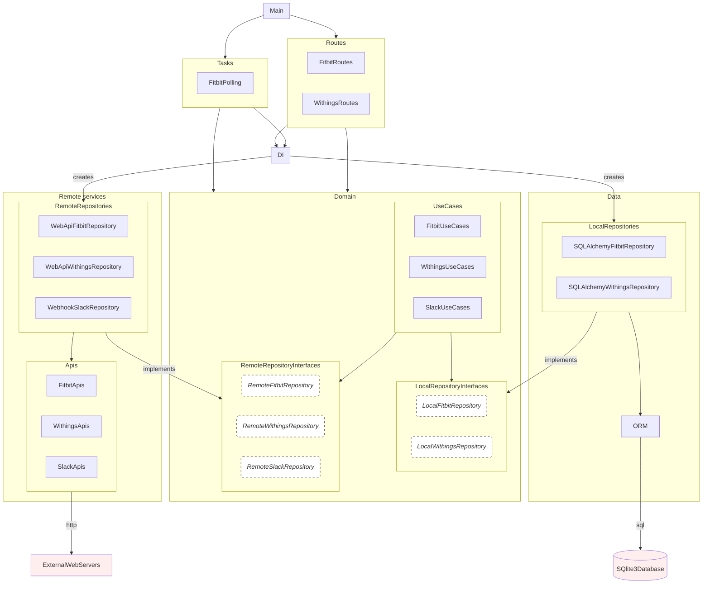
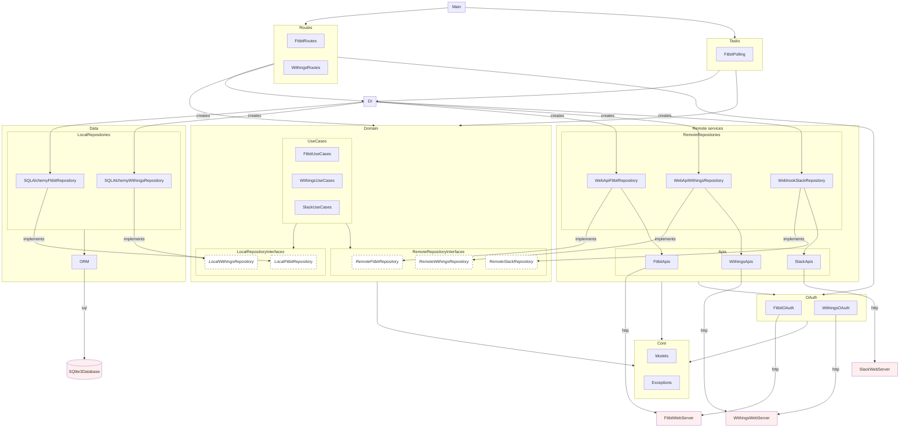

# Architecture

The arrows in the architecture indicate dependencies. For example, the Data layer depends on the Domain layer.

## Level 1 - overview

## Level 2 - some more details

## Level 3 - even more details

## Level 4 - TLDR arrows everywhere

